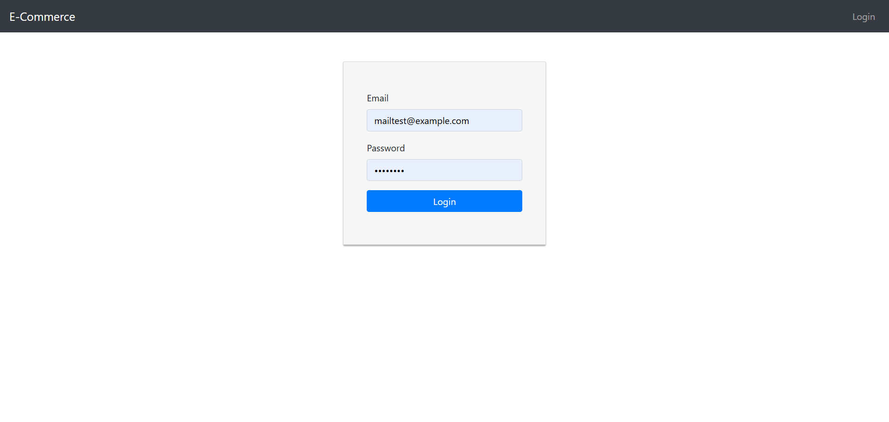
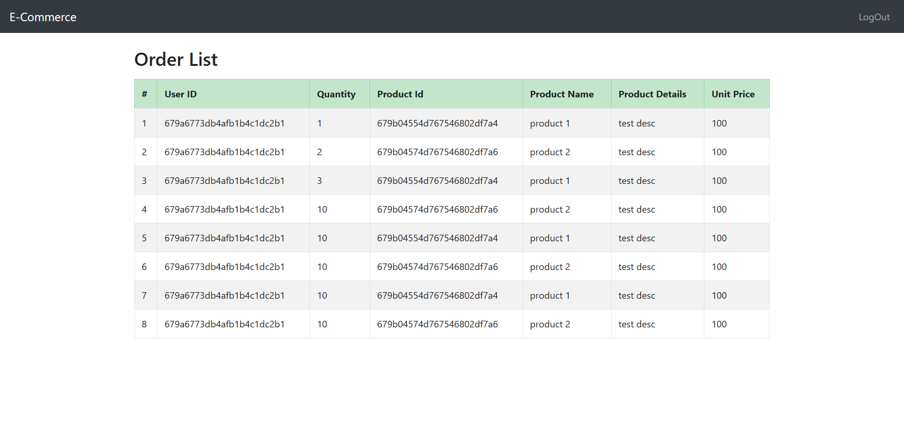
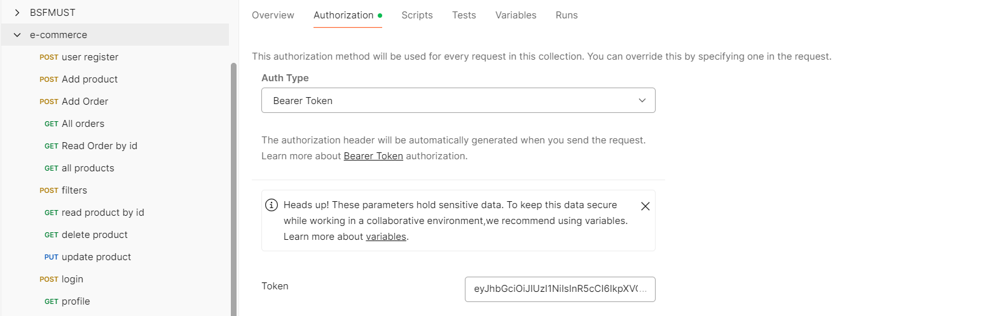

# Simple E-Commerce Microservice using the MERN Stack

Objective:
 Build a microservice-based e-commerce platform using the MERN stack. Each service must use its own database .:
- JWT Authentication Flow for User regitser & User Login, and secure each service with JWT authorizations
- Tools: ExpressJs, mongodb, docker, reactJs, and TypeScript
- Note:Minimum Node version 18 is required

Setup:
- Clone git repository: ```git clone git@github.com:wubrafiq807/e-commerce.git ```
- Run Manually : Go to project root  and then go user-service root run command. `npm install ` to install the dependancy and `npm start` to start services. DO same for each service forder root (user-service, order-service, product-service)
- Run with docker : Make sure enviroment has docker installed and then run command in projects root folder  :```docker-compose up --build```
- Make sure ports ``5000, 5001, 5002`` are not using any others programs in your machine

Service will starts in ports bellow:
- User Service: http://localhost:5000/api/users
- Produtc Service: http://localhost:5001/api/products
- Order Service: http://localhost:5002/api/orders

Evironment Variable:
- Update ``MONGODB_URI`` in each service .env file for mongo connections string . I`m using mongodb cloud free cluster 
- Make sure ``JWT_SECRET`` is same in each service .env file; otherwise auth will not work.


### Set port
.env
```
PORT=8081
```

## Frontend setup

In the frontend directory, you can run:

```
npm install
# or
yarn install
```

or

### Compiles and hot-reloads for development

```
npm start
# or
yarn start
```

Open [http://localhost:8081](http://localhost:8081) to view it in the browser.

Login Page: 
- Default email , and password are
```
Email: mailtest@example.com
Password:test0001
```
You can create new use with API .



Order List Page:



Test API :
- Please collect the postman collection ```e-commerce.postman_collection.json``` file and import to postman . You need to use bearer token options for authorizations .



User/Auth Service Endpoints:
- POST /register: Register a user (name, email, password).
- POST /login: Authenticate user and return JWT.
- GET /profile: Fetch user profile (protected route).

Product Service Endpoints (protected route):
- POST /products: Add a product (name, description, price).
- GET /products: List all products.
- GET /products/:id: Get product details.
- PUT /products/:id: Update product details.
- DELETE /products/:id: Delete a product.

Order Service Endpoints (protected route): 
- POST /orders: Create an order (userId, productId, quantity).
- GET /orders: List all orders with associated product details.
- GET /orders/:id: Fetch a specific order with product details.

